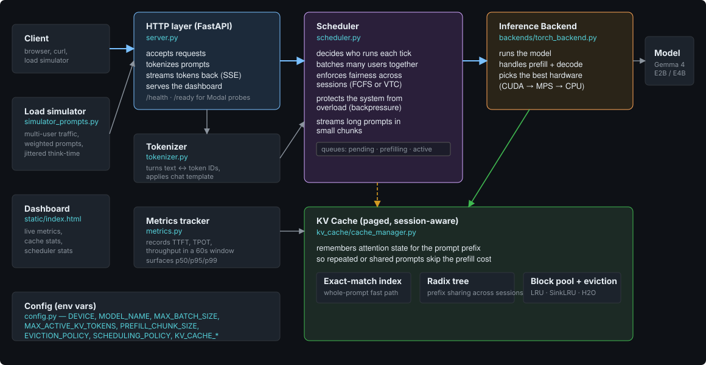

# Inference Server

A production-grade, multi-user **LLM inference engine built from scratch in Python**

Built on Gemma 4 (E2B, E4B) with a custom forward pass byte-identical HF transformers.

## Live architecture map

The full interactive architecture — click any block to see into the scheduler, backend, KV cache, or HTTP layer:

[](https://advaymonga.github.io/inference-server/architecture.html)

> **[→ Open the live, clickable architecture map](https://advaymonga.github.io/inference-server/architecture.html)**

## What's inside

| Component | Role |
|---|---|
| **Continuous batching** | Iteration-level scheduling — new requests fill freed slots immediately, no fixed batch windows. |
| **Fair scheduler** | FCFS + VTC fairness policies, priority hooks, per-session admission, queue + KV backpressure (HTTP 429). |
| **Paged KV cache** | Block-paged per-layer KV with refcounted blocks, lazy allocation, and SDPA gather — vLLM/PagedAttention layout. |
| **Cross-session prefix sharing** | Radix-tree + exact-match index so repeated or shared-system prompts skip prefill (measured 3.88× on a repeat prompt). |
| **Eviction policies** | Pluggable per-session: LRU · AttentionSink · H2O. |
| **Custom Gemma 4 forward** | Dual-RoPE, GQA with QK/V-norm + KV sharing, GeGLU MLP, per-layer embedding gating, softcapping. |
| **Backend abstraction** | `InferenceBackend` — swap backends (HF Transformers / custom) via config. Auto-detects CUDA → MPS → CPU. |
| **Observability** | Sliding-window p50/p95/p99 TTFT / TPOT / throughput, live dashboard, built-in load simulator. |

**Primary metrics:** per-user p95 TTFT/TPOT under concurrent load, and throughput at a fixed tail-latency budget — measured against vLLM on the same model and hardware.

## Results

A100-80GB, Gemma 4 E4B, identical closed-loop concurrency sweep (N=32):

| engine | throughput | TPOT p50 | TTFT p50 |
|---|---|---|---|
| naive HF (`AutoModelForCausalLM`) | 125 tok/s | 118 ms | 3459 ms |
| this engine | 1151 tok/s | 24 ms | 107 ms |
| vLLM 0.23 | 2628 tok/s | 11 ms | 48 ms |

## Setup

```bash
python -m venv venv && source venv/bin/activate
pip install -e ".[dev]"
cp .env.example .env          # then configure your model
```

Download and configure the model via HuggingFace, then set `MODEL_NAME` in `.env`.

## Configuration

All settings are env vars in `.env` — see `.env.example` for the full list. Key knobs:

- `DEVICE` — `cuda` / `mps` / `cpu` (auto-detected if unset)
- `BACKEND` — `torch-*` (HF) or `custom-*` (custom model forward pass)
- `MAX_BATCH_SIZE`, `MAX_ACTIVE_KV_TOKENS` — concurrency + KV budget
- `SCHEDULING_POLICY` — `fcfs` / `vtc`
- `EVICTION_POLICY` — `lru` / `sink` / `h2o`

## Run

```bash
uvicorn inference_server.server:app --host 0.0.0.0 --port 8000
```

Open `http://localhost:8000` for the dashboard, live metrics, and built-in load simulator.
